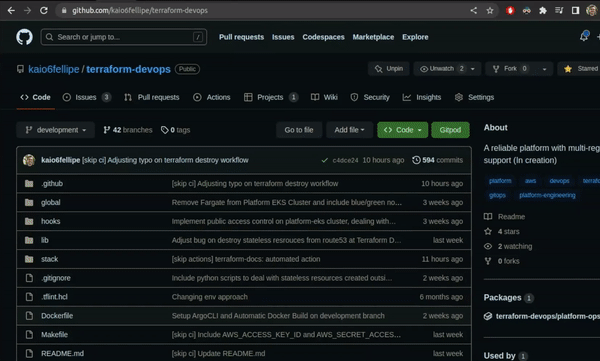

# A project to practice Terraform

 

  
| Env | Status | Availability | Uptime |
|-----|--------|--------------|--------|
| Development |  |  | 

> What came first, the egg or the chicken?
>
> In my case, the infrastructure that maintains the remote state of this Terraform repository 😁
>
> Everything is based on the GitOps flow where my source of truth are my GitHub repositories.

## 🧐 How it works?

This project represents the bootstrap of my development platform together with a combination of several tests using Infrastructure as Code with GitOps where I create and destroy all this infrastructure at once, several times, without any degradation in the services when they come online again.

The objective of this project will be to reach the point where I bootstrap a platform EKS cluster that will have Crossplane and ArgoCD running, from that point on, infrastructure management will be carried out by these two tools and Terraform will be a fallback for functionalities that the Crossplane cannot reach.

The remote state is being managed in the repository: [terraform-remote-state](https://github.com/kaio6fellipe/terraform-remote-state).

The configuration management is being performed by the "Ansible Controller" in the following repository: [ansible-devops](https://github.com/kaio6fellipe/ansible-devops).

Bootstrap management and application management at Platform EKS Cluster is being performed by ArgoCD in the following repository: [argo](https://github.com/kaio6fellipe/argo).

## ✨ Demo

### **Terraform Apply**

### **Terraform Destroy**

## 🛠️ Setup

### **AWS**

- Create an account at AWS
- Create a User group for Admin users and associate the pre-defined permissions "AdministratorAccess"
- Create a new user for yourself
  - Associate the user with the Admin group
- Create a user to use with Terraform
  - Associate the user with the Admin group
  - Create a new Access Key to use it on GitActions workflows

#### **Optional**

if you want to use public DNS zones, make sure that you have a valid domain in your name and that you can manage it, in my case, I bought a domain at [Registro.br](https://registro.br/) and registered a DNS public zone on Route53 in AWS following the instructions that AWS gives.

With that in hand, I also had to request a public wildcar SSL certificate for my domain outside of Terraform in the AWS Certificate Manager, this certificate is self-assigned for resources that use HTTPS and that are managed by AWS, such as Load Balancers, API Gateways, cloudfront, etc.

### **GitHub**

- Setup the [Terraform repository](https://github.com/kaio6fellipe/terraform-remote-state) that will manage your remote state on the S3 bucket
  - Include the Access Key ID and the Secret Access Key as a Secret on this repository (Settings -> Secrets and variables -> Actions -> New repository secret)
- Setup the [Terraform repository](https://github.com/kaio6fellipe/terraform-devops) that will manage your entire infrastructure in a GitOps flow
  - Include the Access Key ID and the Secret Access Key as a Secret on this repository (Settings -> Secrets and variables -> Actions -> New repository secret)

## ⭐️ Show your support

Please ⭐️ this repository if this project helped you!
